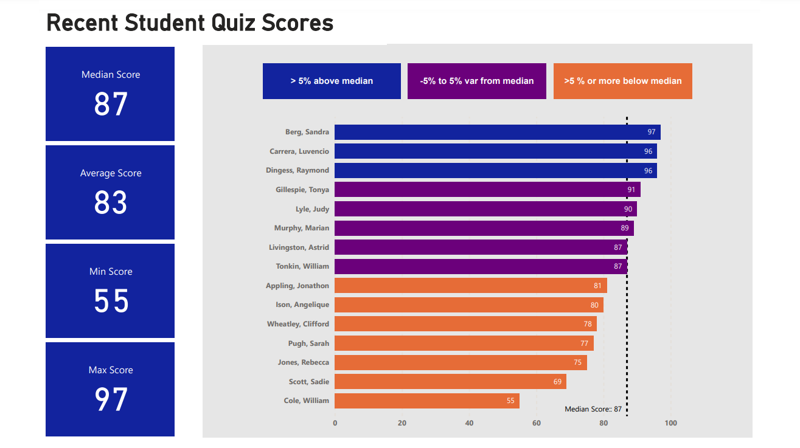

# Recent Student Quiz Scores Dashboard

## Overview

This Power BI report visualizes the recent quiz scores of students. The dashboard is designed to give a quick and clear overview of student performance, including metrics such as the median score, average score, minimum score, and maximum score. The report also categorizes student scores into three performance bands relative to the median score: 

- **>5% above median**
- **-5% to 5% variance from median**
- **>5% or more below median**

## Report Components

### 1. **Key Metrics Display**
- **Median Score:** Displays the median quiz score among all students.
- **Average Score:** Shows the average quiz score.
- **Minimum Score:** Indicates the lowest quiz score.
- **Maximum Score:** Displays the highest quiz score.

### 2. **Bar Chart - Student Performance**
- **X-axis:** Represents the quiz scores ranging from 0 to 100.
- **Y-axis:** Lists the names of the students.
- **Color Coding:** 
  - **Blue bars:** Students scoring more than 5% above the median.
  - **Purple bars:** Students scoring within a 5% range of the median (either above or below).
  - **Orange bars:** Students scoring more than 5% below the median.
- **Dashed Line:** The dashed line on the chart marks the median score of 87, helping to visualize how each student's score compares to the median.

### 3. **Performance Categories**
- The students are visually grouped based on their performance relative to the median score. The color coding aids in quickly identifying which students are performing above or below the median, and which are within the normal variance range.

## How to Use the Dashboard

1. **Viewing Key Metrics:** 
   - Use the metric boxes on the left to quickly understand the overall performance in the recent quiz.

2. **Analyzing Individual Performance:** 
   - Use the bar chart on the right to see where each student stands in relation to the median score.
   - The colors on the bar chart allow you to quickly identify outliers, both high and low performers.
